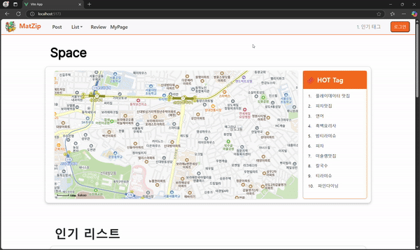
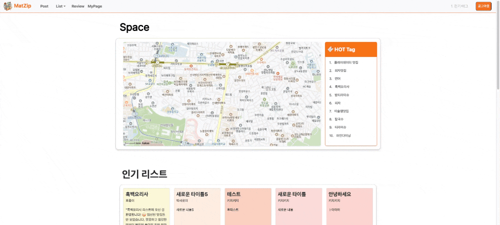
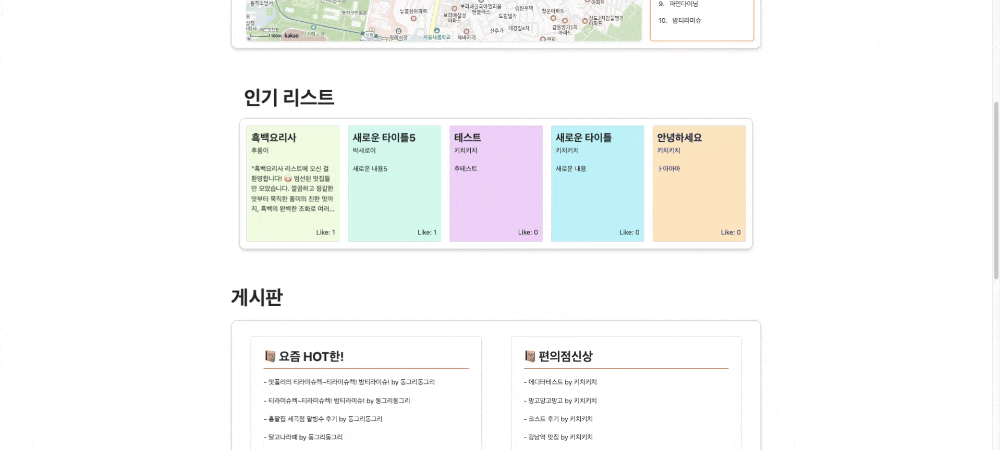
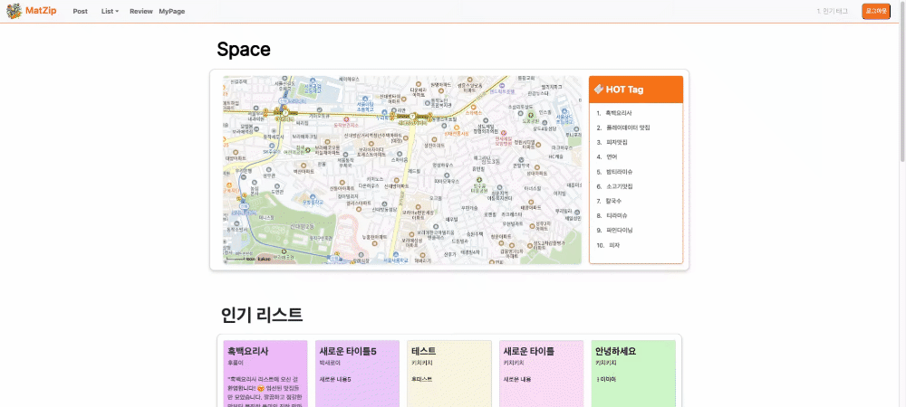
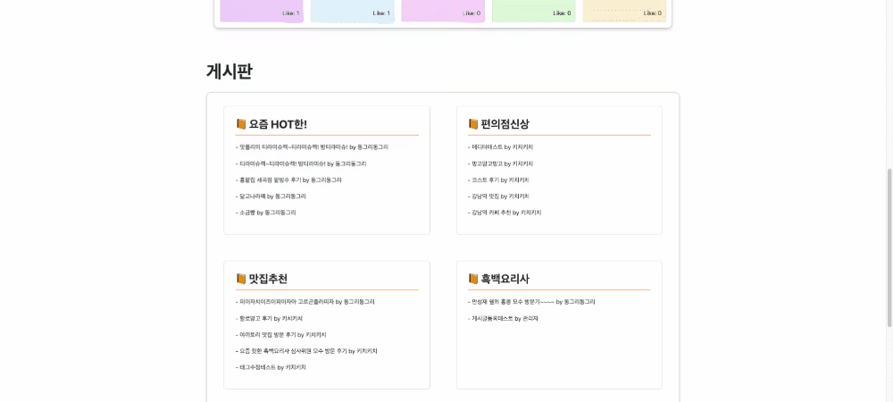
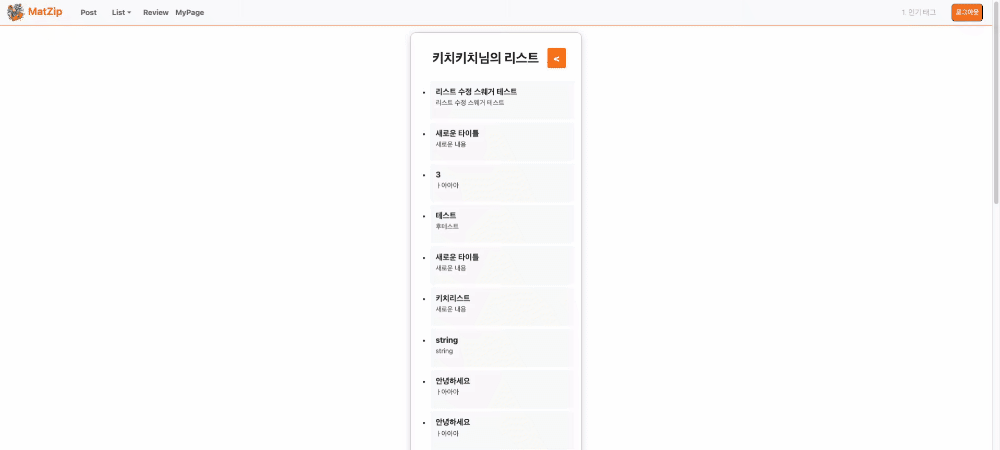
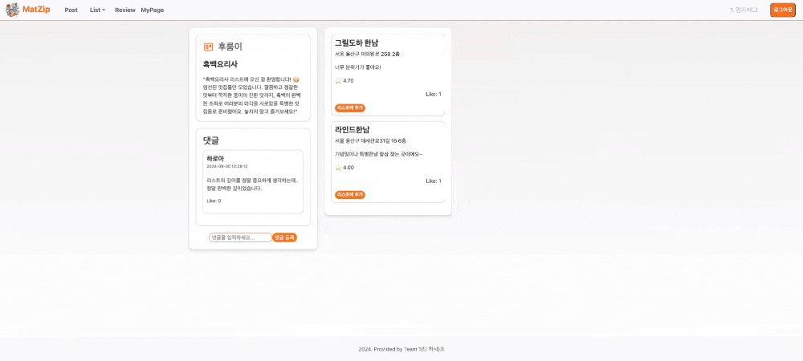
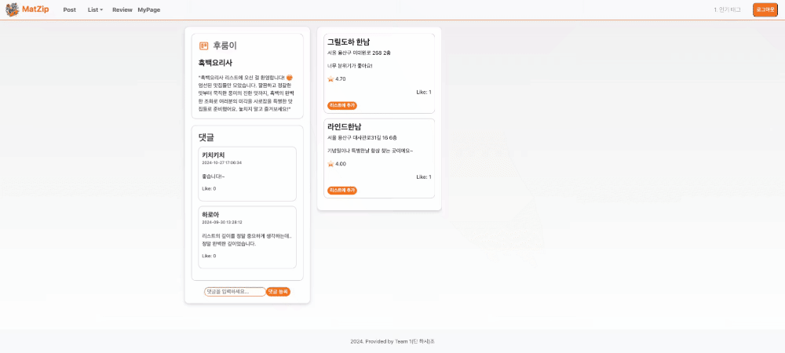

# MAT.zip

## TEAM
|  |  |  |  |  | |
|---|---|---|---|---|---|
| 김윤후 | 김태영 | 남가람 | 박희찬 | 윤지영 | 이창윤 |

## 목차
- [MAT.zip](#matzip)
  - [TEAM](#team)
  - [목차](#목차)
  - [1. 프로젝트 개요](#1-프로젝트-개요)
  - [2. 프로젝트 주요 기능](#2-프로젝트-주요-기능)
    - [2-0. 백엔드 연동](#2-0-백엔드-연동)
  - [3. 산출물](#3-산출물)
  - [4. 회고](#4-회고)

## 1. 프로젝트 개요
> 해당 프로젝트는 앞서 진행된 백엔드 프로젝트에 맞는 프론트엔드를 구현한 프로젝트입니다.
> 상세 개요는 백엔드 프로젝트와 동일합니다.

백엔드 프로젝트 - [be10-2nd-1DANDOIT-mat.zip](https://github.com/beyond-sw-camp/be10-2nd-1DANDOIT-mat.zip)

## 2. 프로젝트 주요 기능
### 2-0. 백엔드 연동
기본적으로 백엔드 서비스를 그대로 구동하고 백엔드의 Spring Cloud Gateway와 API로 통신하여 클라이언트 사이드 랜더링으로 프론트엔드를 구현하였습니다.

## 3. 산출물

  
<strong> 로그인 </strong>

  <h4> - 로그인 </h4>

  

  
<strong> 메인 화면 </strong>

  <h4> - 메인화면 </h4>

  

  <h4> - 메인화면 -> 리스트 </h4>

  
  
  <h4> - 메인화면 -> 전체 리스트 </h4>

  

  <h4> - 메인화면 -> 게시판 </h4>

  

  <h4> - 메인화면 -> 게시판 리스트 </h4>

  

<strong>리스트</strong>

  <h4> - 리스트 생성 </h4>

  

  <h4> - 리스트 댓글 등록 </h4>

  

  <h4> - 리스트 맛집 가져오기 </h4>
  
  
  
  <h4> - 리스트 -> 유저 리스트 목록 </h4>
  
  
  
  <h4> - 전체 리스트 -> 리스트 상세조회 </h4>
  
  

## 4. 회고

| 이름      | 회고 내용                                                                                                                                                                                                                                                                                                                                                                                                                                                                                                             |
|---------|-------------------------------------------------------------------------------------------------------------------------------------------------------------------------------------------------------------------------------------------------------------------------------------------------------------------------------------------------------------------------------------------------------------------------------------------------------------------------------------------------------------------|
| **이창윤** | 이번 프로젝트를 통해 프론트의 기본적인 동작구조와 서버와의 통신이 어떻게 이루어지를 전반적으로 알게 되었습니다. 프론트를 자세히는 모르고 백엔드 서버를 구축하였기에 기대와는 다르게 필요한 정보가 다른 부분도 많았지만 프론트와 백을 통합시키는 과정에서 더욱 세부적인 지식을 얻었다고 생각합니다. 이 프로젝트를 토대로 다음 프로젝트에서는 더 신중하게 백을 다뤄야겠다는 생각도 하였고 프론트에서 직접적으로 필요한 정보가 무엇인지도 정확히 분석하여 만들어야겠다는 다짐을 하였습니다.  정말 뜻깊은 경험이었으며 앞으로 저의 개발 로드에서 중요한 획을 긋는 프로젝트라 생각합니다. 팀원들에게 모두 감사드리고 모두 고생많았다고 전하고 싶습니다. 팀장으로써 부족한 부분이 많았지만 너그럽게 이해해주셔서 다들 감사합니다. 모두 고생많았어요!!                                                                                        |
| **김윤후** | 백엔드 프로젝트를 진행하면서 백엔드 설계의 중요성을 깊이 이해하게 되었고 프론트엔드와의 연결이 어떻게 이루어지는지 직접 경험할 수 있었습니다. 이 과정에서 백엔드 설계 시 확장 가능성과 기술 구현을 더욱 세밀하게 고려할 수 있는 역량을 쌓았고 동시에 프론트엔드에 대한 지식도 넓힐 수 있었습니다. 또한 프론트엔드와 백엔드를 동시에 고려해보며 얻게된 지식을 바탕으로 더욱 유연하고 효과적인 백엔드 설계에 대해 고민해 볼 수 있었습니다. 이 다음을 위해 앞으로 프론트엔드, 웹, 그리고 네트워크에 대한 공부를 지속하고 싶습니다.   팀 활동을 하며 여러 우여곡절을 겪었지만 훌륭한 팀원들과 함께 할 수 있었던 것은 큰 행운이었습니다. 서로 의지하고 함께 어려움을 극복해 나가면서 많은 것을 배울 수 있었고 효율적인 업무 처리와 협업 방식에 대해 깊이 고민하게 되는 소중한 시간이었습니다. 어려움이 오히려 성장의 기회가 되었다는 점에서 이번 경험은 저에게 많은 영감을 주었습니다. |
| **김태영** | 이번 프로젝트를 통해 프론트엔드의 기본 동작 구조와 서버와의 통신 방식에 대해 전반적으로 이해하게 되었습니다. 개발 초기 단계에서 프론트와 백엔드에 대한 지식이 부족함을 느꼈고, 두 부분 모두에서 개선이 필요하다는 것을 깨달았습니다. 특히 백엔드를 구축한 후 프론트를 개발하면서, 프론트에서 백엔드에 요청하는 정보가 예상과 많이 다르다는 사실을 알게 되었습니다.    이 경험을 바탕으로 다음 프로젝트에서는 백엔드를 더 신중하게 다루고, 프론트에서 필요한 정보를 정확히 분석하여 개발할 것을 다짐하였습니다. 이번 프로젝트에서 큰 성과를 내지 못해 팀원들에게 미안한 마음이 큽니다. 이를 통해 프론트 개발의 부족한 부분을 명확히 인지하게 되었고, 다음 프로젝트에서는 같은 결과를 반복하지 않기 위해 철저히 준비할 계획입니다. 이번 경험이 앞으로의 성장에 큰 밑거름이 되기를 바랍니다.                                                       |
| **박희찬** | 프로젝트가 끝나고도 프론트엔드가 제일 어려운 것 같습니다. 비교적 난이도가 낮다는 Vuejs조차 이렇게 적응이 안되는 것을 보니 갈 길이 멀다는 생각이 듭니다. 포기하지 않고 끝까지 함께 해준 팀원들에게 감사하다는 말씀 올립니다.                                                                                                                                                                                                                                                                                                                                                                                  |
| **누군가** |                                                                                                                                                                                                                                                                                                                                                                                                                                                                                                                   |
| **누군가** |                                                                                                                                                                                                                                                                                                                                                                                                                                                                                                                   |

